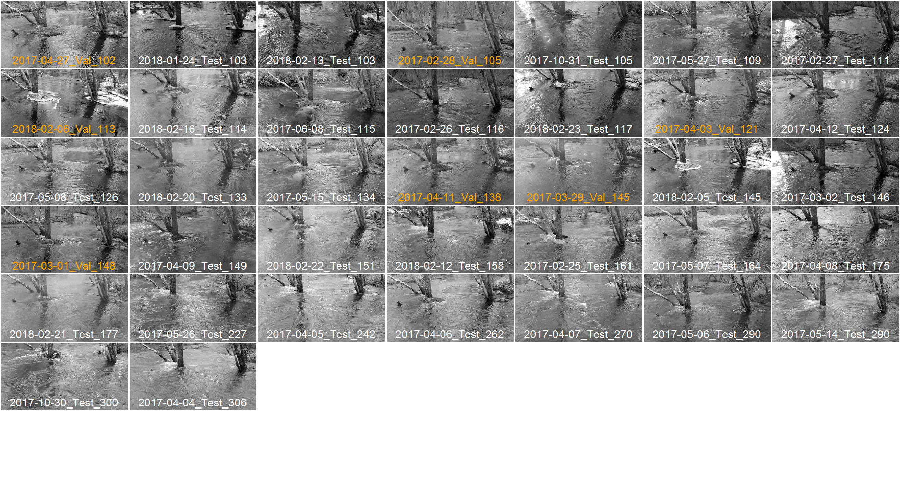

# flowFromImages

There are very few USGS gages in smaller streams. Most of the work of the Ecology Section at the USGS S.O. Conte Lab involves estimating population dynamics of streams fishes. One of the key population drivers is stream flow. Here, we evaluate whether we can use deep learning alogithms to estimate stream flow from cell phone images. The raw images are at http://fpe.ecosheds.org and were taken during daily dog walks on the Sawmill River in Montague, MA.

We use the keras package in R to estimate flow from images using a 2d convolution network.

You will need this directory structure:
```bash
| root
├── flowFromImages
│   ├── R
|   |── data
|   |── img
│   │   ├── imagePNGs
│   │   ├── imageActivations
│   │   ├── imageFilters

```
To estimate flow using flow categories use 'mainAnalysis_categorical.R'.
To estimate flow using regression use 'mainAnalysis_regression.R'

Original images are accessed from flickr and stored in the /img directory
Subsetted and processed images can be viewed as png files in the /img/imagePNGs directory (see below for examples - estimated flow from a nearby gage is the last number in each image).

## Low flow images


## High flow images


As of 3/19/18, the model are overfit. Need more images.
